# Practical Application Assignment 5.1: Will the Customer Accept the Coupon?

## Background

As part of the UC Berkeley Professional Certificate in Machine Learning
and Artificial Intelligence (UC Berkeley, 2022), this assignment is the
first of three Modules designed to test our new skills. We are to use
the Cross Industry Standard Process for Data Mining (CRISP-DM) method
(Schröer, et al, 2021) of data analysis, see Figure 1 below, on a
dataset of survey questions.

Figure 1: The Cross Industry Standard Process for Data Mining (CRISP-DM)

**CRISP-DM**

The CRISP-DM (Cross-Industry Standard Process for Data Mining) approach
to data analysis involves six major steps as outlined below:

- Understanding the Business: This initial step involves conducting an
  in-depth analysis of the business objectives and needs. It includes
  assessing the current situation, defining goals based on insights, and
  setting up a plan to proceed.

- Understanding the Data: In this phase, data is collected from various
  sources, its format and type are determined, and the data is profiled.
  Tasks include exploring the data, describing it, and ensuring its
  quality, accuracy, and validity.

- Data Preparation: Careful selection, cleansing, construction, and
  formatting of the data are carried out in this step. The data is
  organized for modeling, and information exploration is conducted to
  identify patterns aligned with business insights.

- Modeling: The modeling phase involves selecting modeling techniques,
  generating test scenarios for validation, building various models, and
  assessing them to ensure alignment with business objectives

- Evaluation: During this phase, the results of the models are evaluated
  against business intentions. Multiple models are assessed to determine
  which one best meets the project's goals.

- Deployment/Communication: The final step involves presenting the
  gathered information in a usable manner to stakeholders according to
  their expectations and business requirements. This phase may vary in
  complexity based on numerous factors.

## Scope of this Assignment

As this is the first Module that involves a practical application of the
data analysis, this assignment only covers the first three sections of
the CRISP-DM methodology: Business Understanding, Data Understanding,
and Data Preparation. Subsequent assignments will delve into Data
Modeling and the other more complex steps of the methodology.

## Business Understanding

Many businesses offer discount coupons to potential customers to test
the price sensitivity of different groups of buyers. Coupons are often
part of a marketing mix of incentives to get customers to try new
products or to sway customers away from competitors (Canedy, 1998)

**Business Objectives**

The business objective was to conduct an interview type survey of a
group of potential customers as a way of assessing the effectiveness of
a coupon marketing campaign. By conducting a survey, the marketing
organization can infer the type of coupon, the ideal target customer,
and the conditions upon which to introduce the coupon for maximum
impact.

The specifics of the survey was to gather data on potential customers on
whether they would accept a discount coupon under different driving
conditions. There were several types of coupons, some for a coffee shop,
some were to a cheap restaurant, and others to a more expensive
restaurant. The driving conditions varied to include hot and cold
temperatures and sunny, snowy, and rainy weather. The motivation for
driving also varied, from an urgent destination to a casual drive. The
driver was asked to consider their response if they have a certain type
of passenger on board during the trip.

The survey was conducted using the Amazon Mechanical Turk (Buhrmester,
2016), which is a service provided by Amazon that uses inexpensive labor
to conduct research. Participants that are employed by Amazon can earn
extra income by performing the customer interviews using a scripted
survey form and capturing the data into a database. The survey data from
all the participants is then organized as a dataset that can be used for
data analysis.

## Data Understanding

Various tools and resources are used for conducting the Data
Understanding step.

**Dataset**

The dataset used for this assignment was provided as part of the
assignment in a Comma Separated Values (CSV) format.

The dataset is organized in a tabular fashion with each row representing
a single customer interaction and each column representing the features
or columns of data that was collected.

As described in the assignment, the attributes of this dataset include:

1\.User attributes

\- Gender: male, female
\- Age: below 21, 21 to 25, 26 to 30, etc.
\- Marital Status: single, married partner, unmarried partner, or widowed
\- Number of children: 0, 1, or more than 1
\- Education: high school, bachelor’s degree, associate’s degree, or graduate degree
\- Occupation: architecture & engineering, business & financial, etc.
\- Annual income: less than \\\$12500, \\\$12500 - \\\$24999, \\\$25000 - \\\$37499, etc.
\- Number of times that he/she goes to a bar: 0, less than 1, 1 to 3, 4 to 8 or greater than 8
\- Number of times that he/she buys takeaway food: 0, less than 1, 1 to 3, 4 to 8 or greater than 8
\- Number of times that he/she goes to a coffee house: 0, less than 1, 1 to 3, 4 to 8 or greater than 8
\- Number of times that he/she eats at a restaurant with average expense less than \\\$20 per person: 0, less than 1, 1 to 3, 4 to 8 or greater than 8
\- Number of times that he/she goes to a bar: 0, less than 1, 1 to 3, 4 to 8 or greater than 8

2\. Contextual attributes

\- Driving destination: home, work, or no urgent destination
\- Location of user, coupon and destination: we provide a map to show the geographical location of the user, destination, and the venue, and we mark the distance between each two places with time of driving. The user can see whether the venue is in the same direction as the
destination.
\- Weather: sunny, rainy, or snowy
\- Temperature: 30F, 55F, or 80F
\- Time: 10AM, 2PM, or 6PM
\- Passenger: alone, partner, kid(s), or friend(s)

3\. Coupon attributes
\- time before it expires: 2 hours or one day

**Jupyter Notebook**

Another resource of this assignment is a Jupyter Notebook template.
Jupyter Notebooks (Jupyter Notebook, n.d.) are interactive computing
tools that allow users to create and share documents containing live
code, equations, visualizations, and narrative text. They are widely
utilized in data analysis, machine learning, statistical modeling, and
more.

The Jupyter Notebook for this assignment is located in Github (Github,
n.d.), which is a widely used platform for hosting software development
projects, including repositories related to data analysis methodologies
like CRISP-DM.

The following is a public link to the GitHub repository for this
assignment:

<https://github.com/andrespineda/UC-Berkeley-MLAI>

**Python and libraries**

The data analysis computer language tool that was used within the
Jupyter Notebook is Python (Python, n.d.). This computer language is
popular with data scientists and along with a specific set of libraries
that were developed for data analysis, are a powerful set of tools for
analyzing datasets.

The following libraries were used in this assignment:

- MatplotLib
- Seaborn
- Pandas
- Numpy
- Plotly

The first step in data understanding is to import the dataset into
Pandas. Pandas is a Python library that facilitates the interrogation
and manipulation of data so that it can be used in data analysis tools,
such as Matplotlib and Seaborn.

Our first look at the dataset uses the Pandas Info method.

**Numerical Values**

The results of the df.info() method list the name of each column and the format of the data
field. Fields that are of the data type int64 are numerical and can be
used directly to quantify the value.

**Object Type Values**

Those datatypes that are of type ‘object’, are usually text fields that
contain categorical values, such as the weather column (Sunny, Snowy,
Rainy). Categorical values are difficult to work with as most of the
data analysis tools only accept numerical values.

**Null Values**

In an ideal world, each data column would have perfectly captured values
and each row would have a complete set of attributes. In the real world,
we often find datasets with missing column data values, where a survey
missed asking a question or the saved value makes no sense. For example,
if the question requires a Yes/No answer and the value saved is 5. Such
a value will cause problems during analysis and therefore must be
replaced or dropped.

- Several of the categorical columns have a value of ‘nan’, which means
  'Not a Number'. We will convert those values into the value of ‘Unknown”
  by using the Pandas ‘fillna ‘method.

**Missing Data**

In this dataset, there are 12,684 rows which are the answers to the
survey questions of 12,684 potential customers. We must look for
anomalies:

- The column ‘**car**’ only has 108 values, so we will drop this column
  as it is not useful.

- The column ‘**toCoupon_GEQ5min’** has the same value ‘1’ for all rows
  and therefore it is also not useful as it does not play a role in
  whether the customer accepted or rejected the coupon.

## Data Preparation

**Data Type Conversion**

Using Python commands, we can convert categorical values into numerical
values so that we can use them in data plotting tools.

For example, we convert the values in the column “destination” by
replacing each different text label into a unique number:

'destination': {'No Urgent Place': 0, 'Home': 1, 'Work': 2}

**Data Dictionary of labels**

The following data dictionary was used to convert categorical values
into numerical values:

{'destination': {'No Urgent Place': 0, 'Home': 1, 'Work': 2},

'passanger': {'Alone': 0, 'Friend(s)': 1, 'Kid(s)': 2, 'Partner': 3},

'weather': {'Sunny': 0, 'Rainy': 1, 'Snowy': 2},

'time': {'2PM': 0, '10AM': 1, '6PM': 2, '7AM': 3, '10PM': 4},

'coupon': {'Restaurant(\<20)': 0, 'Coffee House': 1, 'Carry out & Take away': 2, 'Bar': 3, 'Restaurant(20-50)': 4}, 'expiration': {'1d': 0, '2h': 1},

'gender': {'Female': 0, 'Male': 1},

'age': {'21': 0,
'46': 1,
'26': 2,
'31': 3,
'41': 4,
'50plus': 5,
'36': 6,
'below21': 7},

'maritalStatus': {'Unmarried partner': 0,
'Single': 1,
'Married partner': 2,
'Divorced': 3,
'Widowed': 4},

'education': {'Some college - no degree': 0,
'Bachelors degree': 1,
'Associates degree': 2,
'High School Graduate': 3,
'Graduate degree (Masters or Doctorate)': 4,
'Some High School': 5},

'occupation': {'Unemployed': 0,
'Architecture & Engineering': 1,
'Student': 2,
'Education&Training&Library': 3,
'Healthcare Support': 4,
'Healthcare Practitioners & Technical': 5,
'Sales & Related': 6,
'Management': 7,
'Arts Design Entertainment Sports & Media': 8,
'Computer & Mathematical': 9,
'Life Physical Social Science': 10,
'Personal Care & Service': 11,
'Community & Social Services': 12,
'Office & Administrative Support': 13,
'Construction & Extraction': 14,
'Legal': 15,
'Retired': 16,
'Installation Maintenance & Repair': 17,
'Transportation & Material Moving': 18,
'Business & Financial': 19,
'Protective Service': 20,
'Food Preparation & Serving Related': 21,
'Production Occupations': 22,
'Building & Grounds Cleaning & Maintenance': 23,
'Farming Fishing & Forestry': 24},

'income': {'\$37500 - \$49999': 0,'\$62500 - \$74999': 1,'\$12500 - \$24999': 2,'\$75000 - \$87499': 3,'\$50000 - \$62499': 4,'\$25000 - \$37499': 5,'\$100000 or More': 6,'\$87500 - \$99999': 7,'Less than \$12500': 8},

'Bar': {'never': 0, 'less1': 1, '1\~3': 2, 'gt8': 3, 'Unknown': 4, '4\~8':5},

'CoffeeHouse': {'never': 0,'less1': 1,'4\~8': 2,'1\~3': 3,'gt8': 4,'Unknown': 5},

'CarryAway': {'Unknown': 0,'4\~8': 1,'1~3': 2,'gt8': 3,'less1': 4,'never': 5},

'RestaurantLessThan20': {'4\~8': 0,'1~3': 1,'less1': 2,'gt8': 3,'Unknown': 4, 'never': 5},

'Restaurant20To50': {'1\~3': 0,'less1': 1,'never': 2,'gt8': 3, '4\~8': 4,'Unknown': 5}}

**Correlation between features (variables)**

Now that we have all missing data addressed and all values converted
into numerical values, we can use correlation code to calculate the
potential for a correlation between each feature for those customers
that accepted the coupon. The degree of correlation is measured as a
value between 0 (or a negative number) as little correlation, to as high
as the number 1 for a high degree of correlation. A high degree of
correlation may mean that there is a strong chance that this feature can
be used to predict future acceptance of a coupon, but it may not. It is
just a good place to start when conducting data analysis.

**Initial Seaborn Correlation Matrix**

The following chart contains a Seaborn Heatmap of the correlation
matrix. It depicts the computed correlation value between those
customers that accepted the coupon (Y value = ‘1’) and each of the other
variables:

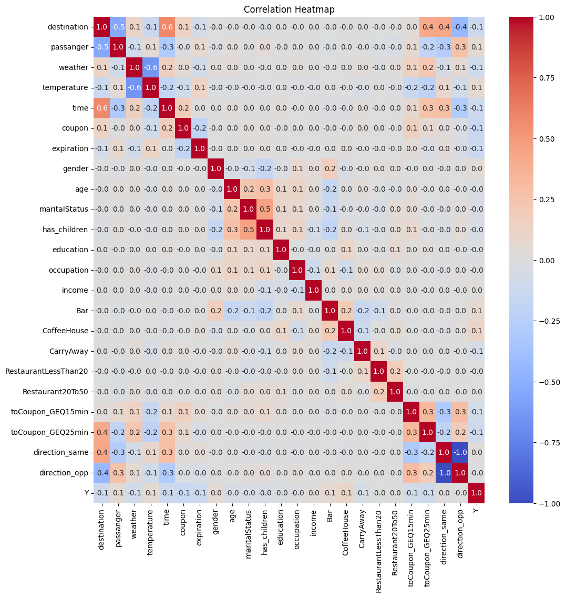

Each square is the intersection of the “Y” variable and each of the
other features (variables).

You can also use this plot to note possible correlations between other
variables.

For example, the feature ‘marital_status’ has a correlation of 0.5 with
the ‘has_children’ feature. This makes sense, as most people with
children are also married.

This plot is very useful for a data scientist to use as a starting point
for more detailed analysis of the data.

**Assignment Questions**

**4. What portion of the total observations chose to accept the
coupon?**

Using the Pandas methods, it is easy to plot a pie chart of those
drivers that would accept the coupon (56.8%) under some conditions and
those that would not (43.2%).

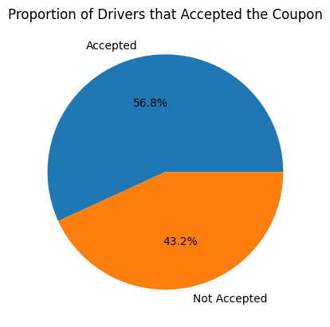

**5. Use a bar plot to visualize the \`coupon\` column.**

The following chart uses a bar plot to depict the count of accepted
coupons by type of coupon:

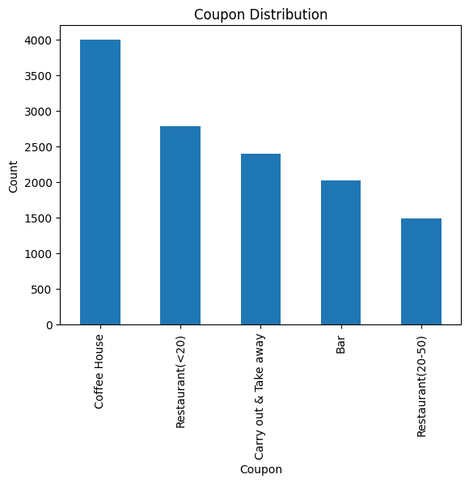

**6. Use a histogram to visualize the temperature column.**

The following chart uses a Seaborn histogram to depict the count of
accepted coupons as it relates to the outside temperature during the
offer.

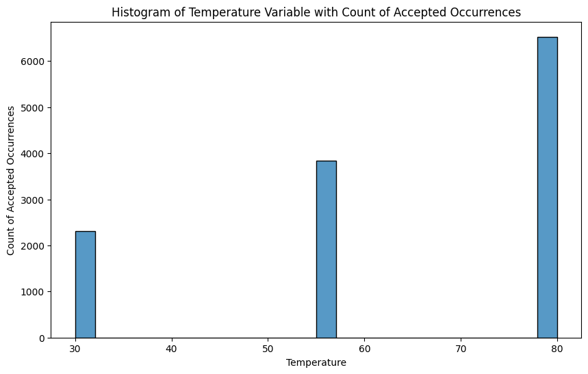

Another plot type that is useful for this type of analysis is the
‘violin’ plot. It visually shows the number of occurrences as the width
of the violin for each temperature range. The chart below shows that
higher temperatures are more conducive to coupon acceptance.

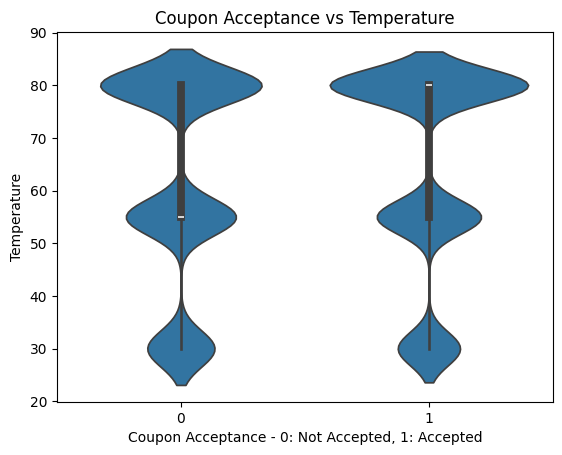

**Bar Coupon Exploration**

The following assignment is to explore the acceptance rate of Bar
coupons as it relates to various other features.

1.  **Create a new DataFrame that contains just bar coupons:**

>bar_coupons_df = df\['coupon'\].replace({v: k for k, v in
>categorical_mapping\['coupon'\].items()})

2.  **What proportion of Bar coupons were accepted?**

The following pie chart depicts the ratio of “Bar” coupons among all
coupons that were accepted. According to the pie chart, 11.5% of the
accepted coupons were of the “Bar” category.

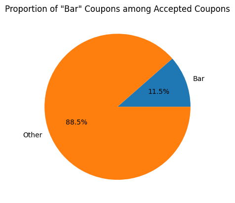

**  
**

3.  **Compare the acceptance rate between those that went to a Bar 3 or
    fewer times a month to those that went more.**

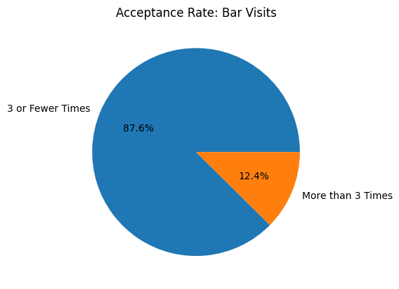

4.  **Compare the acceptance rate between drivers who go to a Bar more
    than once a month and are over the age of 25 to all others. Is there
    a difference?**

The following pie chart shows that those drivers that frequent a Bar
more than once a month and are over 25 are **19.3%** of the total
acceptance rate.

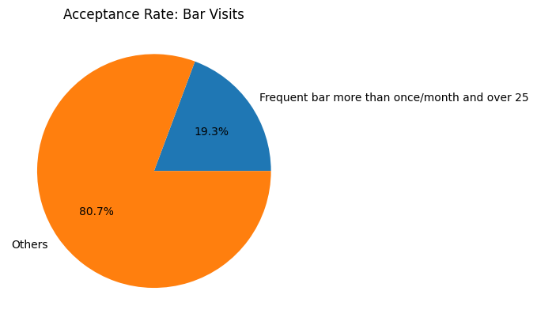

**  
**

5.  **Use the same process to compare the acceptance rate between
    drivers who go to Bars more than once a month and had passengers
    that were not kids and had occupations other than farming, fishing,
    or forestry.**

The following chart shows that drivers who go to Bars more than once a
month and had passengers that were not kids and had occupations other
than farming, or forestry are 24.2% of the acceptance rate.

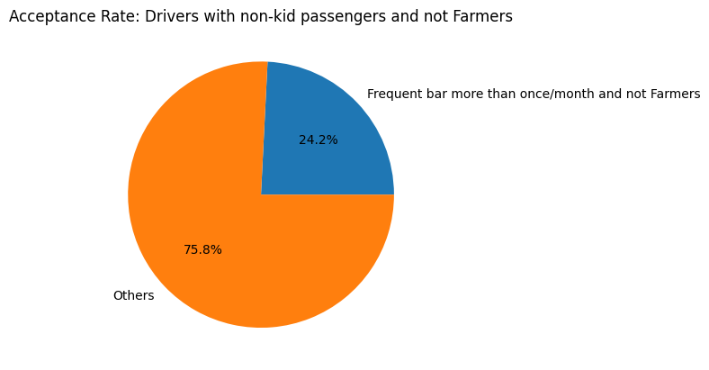

# **6. Compare the acceptance rates between those drivers who:**

# go to Bars more than once a month, had passengers that were not a kid, and were not widowed \*OR\*

# go to Bars more than once a month and are under the age of 30 \*OR\*

# go to cheap restaurants more than 4 times a month and income is less than 50K. 

The acceptance rate of those that met the criteria are 39.3% vs 60.7% of
the others.

# 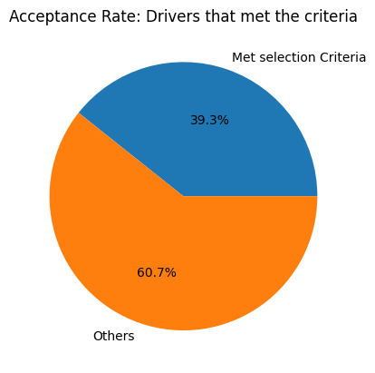

7.  **Based on these observations, what do you hypothesize about drivers
    who accepted the bar coupons?**

Based on the high percentage (39.3%) that met these criteria, it appears
that young, unmarried people with low incomes and that don’t have kids
are a high percentage of those that accept “Bar” coupons.

**  
**

## Independent Exploration

**Coffee House Coupon Exploration**

1.  **What proportion of Coffee House coupons were accepted?**

The following pie chart depicts the ratio of “Coffee House” coupons
among all coupons that were accepted. According to the pie chart, 11.5%
of the accepted coupons were of the “Coffee House” category.

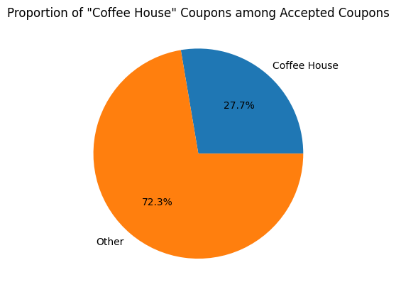

**  
**

2.  **Compare the acceptance rate between those that went to a Coffee
    House 3 or fewer times a month to those that went more.**

> The acceptance rate of those that that went to a Coffee House 3 or
> fewer times a month compared to those those that went more are shown
> in the following chart.
>
> 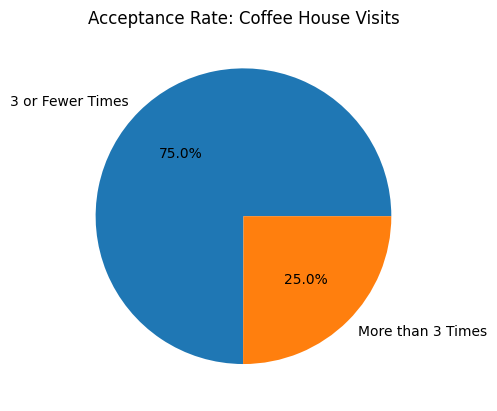 alt="A pie chart with text Description automatically generated" />

3.  **Compare the acceptance rate between drivers who go to a Coffee
    House more than once a month and are over the age of 25 to all
    others. Is there a difference?**

> Yes, those that frequent a Coffee House more than once a month and are
> over 25 are only 27.4% as compared to 72.6% of the others.

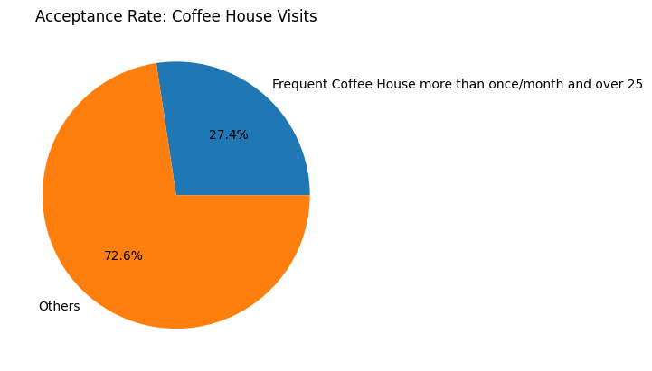

4.  **Use the same process to compare the acceptance rate between
    drivers who go to a Coffee House more than once a month and had
    passengers that were not kids and had occupations other than
    farming, fishing, or forestry.**

The following chart shows that drivers who go to a Coffee House more
than once a month and had passengers that were not kids and had
occupations other than farming, or forestry are 33.3% of the acceptance
rate.

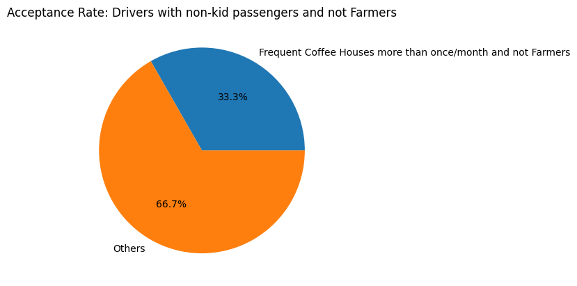

# **6. Compare the acceptance rates between those drivers who:**

# go to a Coffee House more than once a month, had passengers that were not a kid, and were not widowed \*OR\*

# go to a Coffee House more than once a month and are under the age of 30 \*OR\*

# go to cheap restaurants more than 4 times a month and income is less than 50K. 

The acceptance rate of those that met the criteria are 44.3% vs 55.7% of
the others.

# 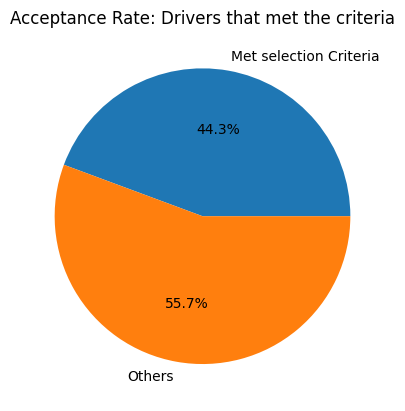

5.  **Based on these observations, what do you hypothesize about drivers
    who accepted the Coffee House coupons?**

Drivers that accepted the Coffee House coupons exceed the number of
drivers that accepted the Bar coupons.

## Findings

There are several key findings from this study:

- Coupons in general are more likely to be accepted if the temperature
  is high (80).

- Coffee House coupons are more likely to be accepted than any other
  coupons in general.

## Next Steps

The next steps in this process will be the Modeling, Evaluation, and
Deployment/Communication steps in the CRISP-DM methodology. These steps
will require skills that we currently have not studied, but we are
looking forward to learning these techniques.

## 

## References

Buhrmester, M., Kwang, T., & Gosling, S. D. (2016). Amazon's Mechanical
Turk: A new source of inexpensive, yet high-quality data? In A. E.
Kazdin (Ed.), Methodological issues and strategies in clinical
research (4th ed., pp. 133–139). American Psychological
Association. [https://doi.org/10.1037/14805-009](https://psycnet.apa.org/doi/10.1037/14805-009)

Canedy, Dana. (January 2, 1998). ["More makers of consumer goods are
delivering samples of their products right to the front
door"](https://www.nytimes.com/1998/01/02/business/media-business-advertising-more-makers-consumer-goods-are-delivering-samples.html). [The
New York Times](https://en.wikipedia.org/wiki/The_New_York_Times).
<https://www.nytimes.com/1998/01/02/business/media-business-advertising-more-makers-consumer-goods-are-delivering-samples.html>

GitHub. (n.d.) “GitHub”. GitHub. <https://github.com/>

Jupyter Notebooks (n.d). “Jupyter Notebooks”. Project Jupyter. https://
jupyter.org

Schröer, Christoph & Kruse, Felix & Marx Gómez, Jorge. (2021). A
Systematic Literature Review on Applying CRISP-DM Process Model.
Procedia Computer Science. 181. 526-534. 10.1016/j.procs.2021.01.199.

UC Berkeley. (August 30, 2022). “UC Berkeley Professional Certificate in
Machine Learning and Artificial Intelligence”. UC Berkeley.
https://em-executive.berkeley.edu/professional-certificate-machine-learning-artificial-intelligence
